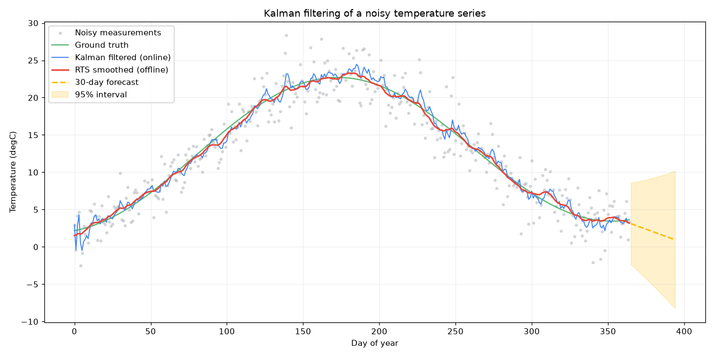
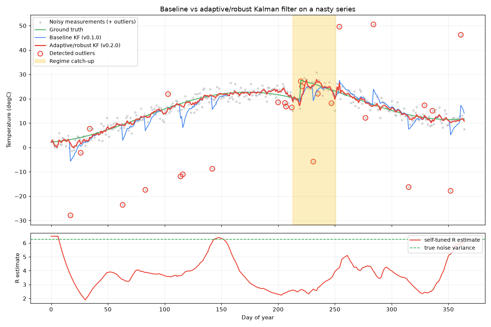

# Kalman Time Series

Denoise and forecast a noisy 1-D time series with a **Kalman filter**, written
from scratch in NumPy — no `filterpy`, no `statsmodels`, no black boxes. The
worked example takes a year of noisy daily temperature readings and recovers
the underlying signal, then forecasts the next 30 days.

This repo ships **two** filters, tagged so you can diff them:

| Tag        | Filter                                | Idea                                                        |
|------------|---------------------------------------|-------------------------------------------------------------|
| **v0.1.0** | textbook local-linear-trend KF        | fixed, hand-tuned noise; trusts every sample                |
| **v0.2.0** | adaptive / robust KF (**+51 % RMSE**) | self-tunes its noise, rejects outliers, tracks regime shifts |

Jump to [**What's new in v0.2.0**](#whats-new-in-v020--the-adaptive-robust-filter) for the head-to-head.



On the clean synthetic benchmark (sensor noise σ = 2.5 °C), the baseline filter
cuts the error against ground truth by ~64% online and ~80% offline:

| Signal                          | RMSE vs truth | Notes                    |
|---------------------------------|---------------|--------------------------|
| Raw measurements                | 2.35 °C       | what the sensor gives you |
| Kalman filtered (causal/online) | 0.85 °C       | uses only past + present  |
| RTS smoothed (offline)          | 0.47 °C       | uses the whole series     |

## The problem

A cheap sensor reports a daily value that is the true quantity plus noise. You
want (a) the best estimate of the *true* value at each day, and (b) a short
forecast with honest uncertainty. This is exactly what a Kalman filter is for:
it maintains a probabilistic estimate of a hidden state, predicting it forward
and correcting it each time a noisy measurement arrives.

## The model — local linear trend

We model the hidden state as a slowly-varying **level** plus a **trend**
(slope). This is a classic *structural time-series* model:

```
state x = [level, trend]

level_k = level_{k-1} + trend_{k-1} + noise      (level drifts by its slope)
trend_k =               trend_{k-1} + noise      (slope drifts slowly)
z_k     = level_k                   + noise       (we only observe the level)
```

In Kalman-filter matrix form:

```
F = [[1, 1],      H = [1, 0]      Q = diag(σ_level², σ_trend²)      R = [σ_obs²]
     [0, 1]]
```

The two knobs that matter:

- **`observation_noise` (σ_obs)** — how much you trust each measurement. Bigger
  ⇒ smooth harder.
- **`level_process_noise` / `trend_process_noise`** — how fast you allow the
  underlying signal to move. Smaller ⇒ smoother, but slower to react to real
  change.

## Quick start

```bash
git clone https://github.com/mbsdeepak/kalman-timeseries.git
cd kalman-timeseries
python -m venv .venv && source .venv/bin/activate
pip install -r requirements.txt

# run the end-to-end demo (prints metrics, writes assets/denoise.png)
python -m examples.denoise_temperature

# metrics only, no matplotlib
python -m examples.denoise_temperature --no-plot
```

## Using it on your own data

```python
import numpy as np
from kalman import local_linear_trend

measurements = np.loadtxt("my_series.csv")   # a 1-D array of noisy readings

kf = local_linear_trend(
    observation_noise=2.5,      # ≈ std-dev of your sensor noise
    level_process_noise=0.5,    # how fast the true level can move
    trend_process_noise=0.01,   # how fast the slope can change
    initial_level=measurements[0],
)

filtered = kf.filter(measurements)          # online estimate
smoothed = kf.smooth(filtered)              # offline, cleaner estimate

clean = smoothed.levels(kf.H)               # denoised signal

# forecast 30 steps beyond the last observation, with 95% band
preds, var = kf.forecast(filtered.states[-1], filtered.covariances[-1], steps=30)
lo, hi = preds - 1.96*np.sqrt(var), preds + 1.96*np.sqrt(var)
```

Gaps are supported: pass `None` (or `np.nan`) for missing days and the filter
predicts through them without a correction step.

## What's new in v0.2.0 — the adaptive / robust filter

The textbook filter has two Achilles' heels: **you have to hand-tune the noise**,
and **it trusts every sample** — so one glitchy reading yanks the estimate off
course, and it lags badly when the signal genuinely jumps. `v0.2.0` adds an
`AdaptiveRobustKalmanFilter` that fixes both, with *no* manual noise tuning.

Run it head-to-head on a deliberately nasty series (seasonal signal + noise +
**sensor outliers** + a permanent **regime shift**):

```bash
python -m examples.compare_versions
```



| Signal on the nasty series | RMSE  | MAE   |
|----------------------------|-------|-------|
| Raw measurements           | 6.04  | 2.76  |
| Baseline KF (v0.1.0)       | 2.48  | 1.66  |
| **Adaptive KF (v0.2.0)**   | **1.21** | **0.83** |

That's a **~51 % lower RMSE** than the baseline — and the adaptive filter was
given *no* measurement-noise parameter; it learned it (final estimate 5.96 vs.
the true variance 6.25). In the plot: the blue baseline is jerked around by
every outlier and lags at the shift, while the red adaptive filter ignores the
circled outliers and the yellow band marks where it detected the regime shift
and jumped to catch up. The bottom panel shows its self-tuned noise tracking the
true variance.

### How it works — three established ideas + one new twist

1. **Self-tuning measurement noise** *(innovation-based adaptive estimation /
   covariance matching)*. `R` is estimated online from the spread of the
   innovations — robustly, via the MAD, so outliers don't corrupt it — instead
   of being supplied by hand. See Zhang et al., *"On the Identification of Noise
   Covariances and Adaptive Kalman Filtering: A New Look at a 50-Year-Old
   Problem"*, 2020 ([PMC8638515](https://pmc.ncbi.nlm.nih.gov/articles/PMC8638515/)).

2. **Robust update** *(Huber weight + χ² innovation gate)*. Each measurement's
   normalized innovation² (Mahalanobis distance) is tested against a χ² gate;
   samples beyond it are down-weighted Huber-style rather than trusted. See
   Wang, Li & Fang, *"Robust Gaussian Kalman Filter With Outlier Detection"*,
   IEEE SP Letters 2018 ([PDF](https://personal.stevens.edu/~hli/papers/WangLiFang18.pdf)).

3. **Adaptive process-noise inflation.** When a real change is detected, `Q` is
   temporarily inflated so the filter reacts fast, then decays back.

4. **The new twist — an outlier-vs-regime-shift router.** A large innovation is
   ambiguous: a one-off glitch (suppress it) or the first sample of a genuine
   level shift (follow it). We disambiguate with a **CUSUM/EMA of the
   robustly-weighted innovations**: random-signed outliers cancel out (and are
   pre-shrunk by their Huber weight), but a true shift builds a persistent
   same-sign bias that trips a threshold and flips the filter into catch-up
   mode. That routing between "down-weight" and "adapt Q" is the piece that
   makes it tell *sensor glitch* from *the world changed*.

> **On novelty:** ideas 1–3 are textbook adaptive-filtering techniques (cited
> above). What's assembled here — a single online filter combining MAD-based
> self-tuned `R`, a Huber χ² gate, and a CUSUM innovation-bias router that
> arbitrates between outlier-rejection and process-noise adaptation — is a
> practical *combination*, not a new theorem. It's a genuinely better filter for
> this class of problem, honestly built on prior art rather than claimed as a
> brand-new algorithm.

### Using it

```python
from kalman import adaptive_local_linear_trend

# note: no measurement_noise argument — it is learned from the data
kf = adaptive_local_linear_trend(initial_level=measurements[0])
res = kf.filter(measurements)

clean       = res.levels(kf.H)        # denoised signal
outlier_idx = [i for i, f in enumerate(res.outlier_flags) if f]
learned_R   = res.r_estimates[-1]     # the noise it taught itself
```

## What's inside

```
kalman/
  filter.py     # general linear Kalman filter: predict / update / RTS smoother / forecast
  models.py     # local_linear_trend(...) — builds the state-space model above
  adaptive.py   # v0.2.0: AdaptiveRobustKalmanFilter — self-tuning R, robust update, regime router
examples/
  synthetic.py            # reproducible noisy-temperature generators (clean + nasty)
  denoise_temperature.py  # the end-to-end demo behind the plot & table above
  compare_versions.py     # v0.1.0 vs v0.2.0 head-to-head on the nasty series
tests/
  test_filter.py          # correctness, noise-reduction, smoother, gaps, forecast, adaptivity
```

The core `KalmanFilter` is model-agnostic — give it `F, H, Q, R` and an initial
`(x, P)` and it works for any linear-Gaussian model (GPS tracking, sensor
fusion, etc.), not just this one. Notable implementation details:

- **Joseph-form covariance update** for numerical stability (keeps `P`
  symmetric positive-definite).
- **RTS smoother** for offline denoising — a backward pass that lets future
  observations refine past estimates.
- **Missing-data handling** — predict-only steps when no measurement is present.

## Tests

```bash
pip install pytest
pytest -q
```

The suite (13 tests) checks the baseline — recovers a known constant, reduces
RMSE vs the raw signal, smoother ≥ filter, covariances stay symmetric PSD, gaps
handled, forecast uncertainty grows — and the v0.2.0 adaptive filter: it
self-tunes `R` near the true variance, beats the baseline by >20% on the nasty
series, down-weights the samples it flags as outliers, and re-converges within
~15 steps of a regime shift.

## License

MIT — see [LICENSE](LICENSE).
